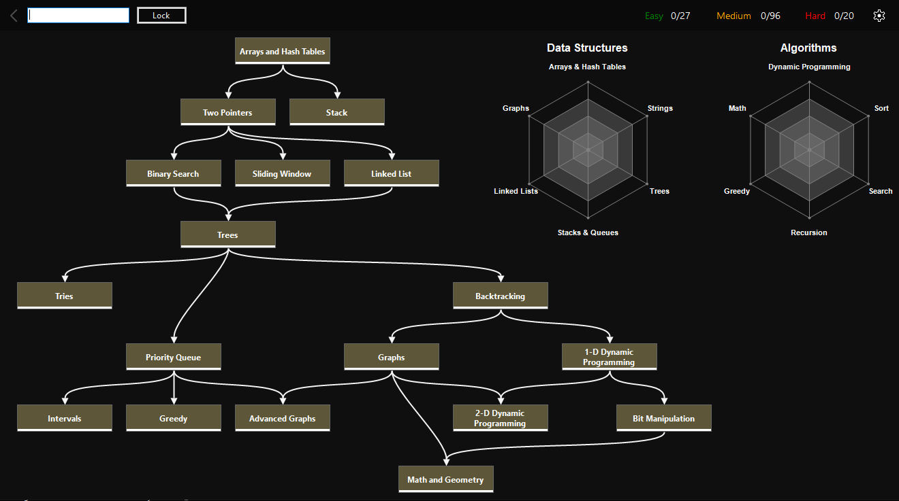
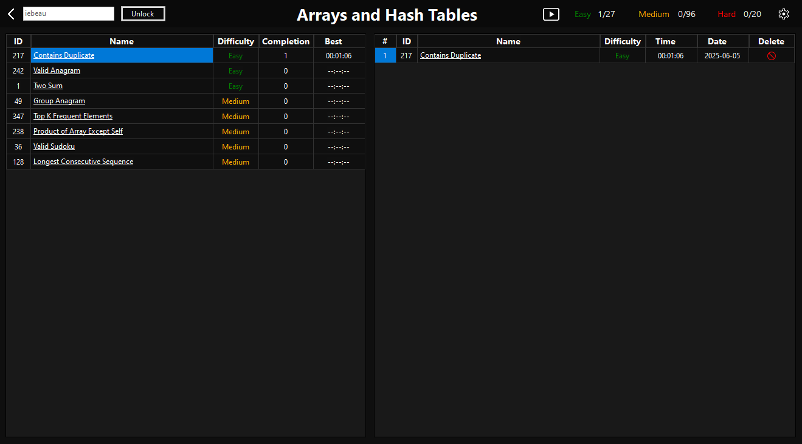

<p align="center"><b>Welcome to LeetCode Coach!</b></p>
---

🚀 Getting Started
---
You can install the application by either cloning the repository (recommended for developers) or downloading the ZIP file (quick and easy for all users).

✅ Option 1: Clone the Repository (Recommended)  
📌 Requires Git
---
1) Open your terminal or command prompt.

2) Navigate to a directory that you wish to clone this repo to.

3) Run the following command:
```sh
git clone https://github.com/iebeau/LeetCodeCoach.git && cd LeetCodeCoach/LeetCodeCoachInstaller/Debug && msiexec /i LeetCodeCoachInstaller.msi
```

📦 Option 2: Download as ZIP  
✔️ No Git Required
---
1) Click the green "Code" button (top right).

2) Select Download ZIP.

3) Once downloaded, extract the ZIP to any folder on your computer.

4) Open the folder in File Explorer.

5) Navigate to:  
LeetCodeCoachInstaller > Debug > LeetCodeCoachInstaller.msi.

6) Double-click it to start the installation.

🖥️ After Installation a shortcut will be placed on your Desktop.
---
1) Open and enjoy!





<p align="center"><i>Roadmap inspired by NeetCode 150.</i></p>